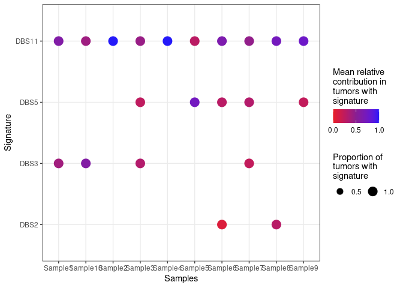

<!-- README.md is generated from README.Rmd. Please edit that file -->

# sigvar

<!-- badges: start -->
<!-- badges: end -->

Sigvar is a R package to conduct signature variability analysis (SVS), that is, quantify, visualize, and test the variability
of mutational signatures within and across samples

## Installation

You can install the development version of sigvar from
[GitHub](https://github.com/) with:

``` r
# install.packages("devtools")
devtools::install_github("MaikeMorrison/sigvar")
```

## Example

This is a basic example which shows you how to import results from
SigProfiler and plot the signature attributions:

``` r
library(sigvar)

SPfolder = system.file("extdata", "example_SigProfiler_results", package = "sigvar")
Qlist = import_SigProfiler(SPfolder)
#> Rows: 10 Columns: 5
#> ── Column specification ────────────────────────────────────────────────────────
#> Delimiter: "\t"
#> chr (1): Samples
#> dbl (4): DBS2, DBS3, DBS5, DBS11
#> 
#> ℹ Use `spec()` to retrieve the full column specification for this data.
#> ℹ Specify the column types or set `show_col_types = FALSE` to quiet this message.
#> Rows: 10 Columns: 3
#> ── Column specification ────────────────────────────────────────────────────────
#> Delimiter: "\t"
#> chr (1): Samples
#> dbl (2): DBS78A, DBS78B
#> 
#> ℹ Use `spec()` to retrieve the full column specification for this data.
#> ℹ Specify the column types or set `show_col_types = FALSE` to quiet this message.
#> Rows: 10 Columns: 7
#> ── Column specification ────────────────────────────────────────────────────────
#> Delimiter: "\t"
#> chr (1): Samples
#> dbl (6): ID1, ID2, ID3, ID5, ID8, ID9
#> 
#> ℹ Use `spec()` to retrieve the full column specification for this data.
#> ℹ Specify the column types or set `show_col_types = FALSE` to quiet this message.
#> Rows: 10 Columns: 6
#> ── Column specification ────────────────────────────────────────────────────────
#> Delimiter: "\t"
#> chr (1): Samples
#> dbl (5): ID83A, ID83B, ID83C, ID83D, ID83E
#> 
#> ℹ Use `spec()` to retrieve the full column specification for this data.
#> ℹ Specify the column types or set `show_col_types = FALSE` to quiet this message.
#> Rows: 10 Columns: 7
#> ── Column specification ────────────────────────────────────────────────────────
#> Delimiter: "\t"
#> chr (1): Samples
#> dbl (6): SBS1, SBS5, SBS8, SBS26, SBS30, SBS40
#> 
#> ℹ Use `spec()` to retrieve the full column specification for this data.
#> ℹ Specify the column types or set `show_col_types = FALSE` to quiet this message.
#> Rows: 10 Columns: 4
#> ── Column specification ────────────────────────────────────────────────────────
#> Delimiter: "\t"
#> chr (1): Samples
#> dbl (3): SBS96A, SBS96B, SBS96C
#> 
#> ℹ Use `spec()` to retrieve the full column specification for this data.
#> ℹ Specify the column types or set `show_col_types = FALSE` to quiet this message.
plot_dots(Qlist[[1]])
#> Warning in Q_checker(Q, K): At least one Q matrix has rows which do not sum to
#> exactly 1. Rounding the sum of each row to 1 by dividing all entries by the sum
#> of the row.
#> Joining with `by = join_by(group, Signature)`
```


