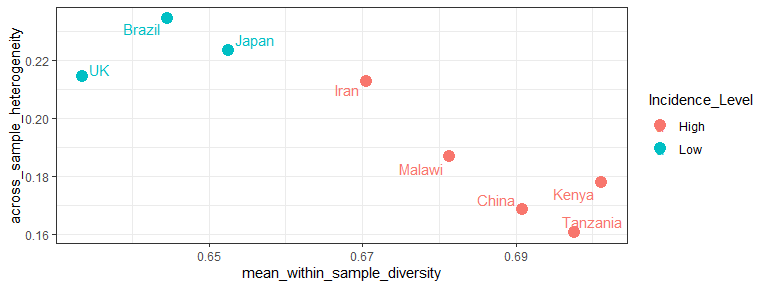
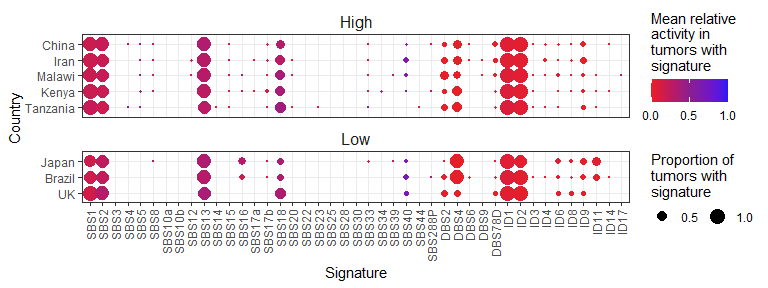

<!-- README.md is generated from README.Rmd. Please edit that file -->

# sigvar

<!-- badges: start -->
<!-- badges: end -->

The R package *sigvar* implements Signature Variability Analysis (SVA),
a framework for the analyis of mutational signature activities within
and across cancer samples. The *sigvar* package contains the following
core functions:

- `sigvar`: Conduct signature variability analysis on a data set. That
  is, compute the within-sample diversity and across-sample
  heterogeneity of mutational signature activity in one or multiple
  populations of samples.

- `sigboot`: Statistically compare the within-sample diversity and
  across-sample heterogeneity of the mutational signature activity in
  two or more groups of tumor samples

*sigvar* also includes accessory functions for the visualization of
mutational signature data, such as:

- `plot_SBS_spectrum`: Plot the SBS mutational spectrum of one or more
  samples or mutational signatures

- `plot_dots`: Plot the mean mutational signature contributions of one
  or more groups of samples

## Installation

You can install the development version of sigvar from
[GitHub](https://github.com/MaikeMorrison/sigvar) with:

``` r
# install.packages("devtools")
devtools::install_github("MaikeMorrison/sigvar")
```

<!-- ## Example -->
<!-- This is a basic example which shows you how to import results from SigProfiler and plot the signature attributions: -->
<!-- ```{r example} -->
<!-- library(sigvar) -->
<!-- SPfolder = system.file("extdata", "example_SigProfiler_results", package = "sigvar") -->
<!-- Qlist = import_SigProfiler(SPfolder) -->
<!-- plot_dots(Qlist[[1]]) -->
<!-- ``` -->

## Example - Esophageal squamous cell carcinoma

In this simple example, we apply SVA to data from [Moody et
al. (2021)](https://www.nature.com/articles/s41588-021-00928-6). This
data set contains 552 esophageal squamous cell carcinoma (ESCC) samples
collected across eight countries which vary dramatically in their
incidence of ESCC. Moody et al. (2021) reported the activities of 43
SBS, DBS, and ID mutational signatures for each sample. Here, we
reanalyze this data set using signature variability analysis.

Each row of this data set reports the relative activity of each
mutational signature for one sample. Because we are analyzing relative
signature activities, each row sums to 1.

``` r
library(sigvar)
library(dplyr)
library(ggplot2)

head(ESCC_sig_activity)
```

    ## # A tibble: 6 × 46
    ##   Country Incidence_Level Sample    SBS1  SBS2  SBS3  SBS4  SBS5  SBS8 SBS10a
    ##   <ord>   <chr>           <chr>    <dbl> <dbl> <dbl> <dbl> <dbl> <dbl>  <dbl>
    ## 1 Kenya   High            PD37727a 0.148 0         0     0     0     0      0
    ## 2 Kenya   High            PD37728a 0.156 0.207     0     0     0     0      0
    ## 3 Kenya   High            PD37729a 0     0.196     0     0     0     0      0
    ## 4 Kenya   High            PD37730a 0.165 0.234     0     0     0     0      0
    ## 5 Kenya   High            PD37731a 0     0.317     0     0     0     0      0
    ## 6 Kenya   High            PD37733a 0.134 0.212     0     0     0     0      0
    ## # ℹ 36 more variables: SBS10b <dbl>, SBS12 <dbl>, SBS13 <dbl>, SBS14 <dbl>,
    ## #   SBS15 <dbl>, SBS16 <dbl>, SBS17a <dbl>, SBS17b <dbl>, SBS18 <dbl>,
    ## #   SBS20 <dbl>, SBS22 <dbl>, SBS23 <dbl>, SBS25 <dbl>, SBS28 <dbl>,
    ## #   SBS30 <dbl>, SBS33 <dbl>, SBS34 <dbl>, SBS39 <dbl>, SBS40 <dbl>,
    ## #   SBS44 <dbl>, SBS288P <dbl>, DBS2 <dbl>, DBS4 <dbl>, DBS6 <dbl>, DBS9 <dbl>,
    ## #   DBS78D <dbl>, ID1 <dbl>, ID2 <dbl>, ID3 <dbl>, ID4 <dbl>, ID6 <dbl>,
    ## #   ID8 <dbl>, ID9 <dbl>, ID11 <dbl>, ID14 <dbl>, ID17 <dbl>

**Signature variability analysis can be conducted in one line of code:**

``` r
sva = sigvar(sig_activity = ESCC_sig_activity, K = 43, group = "Country")

knitr::kable(sva)
```

| Country  | across_sample_heterogeneity | mean_within_sample_diversity |
|:---------|----------------------------:|-----------------------------:|
| Kenya    |                   0.1778148 |                    0.7011235 |
| Iran     |                   0.2126657 |                    0.6705337 |
| Tanzania |                   0.1606487 |                    0.6976021 |
| China    |                   0.1684907 |                    0.6908129 |
| Japan    |                   0.2234567 |                    0.6525885 |
| Malawi   |                   0.1867597 |                    0.6813242 |
| Brazil   |                   0.2344654 |                    0.6446411 |
| UK       |                   0.2143285 |                    0.6335159 |

Signature variability analysis quantifies both the mean signature
diversity within each sample, as well as the heterogeneity in signature
activities across samples. Both variability statistics range between 0
and 1.

If we add to our SVA results a column corresponding to the incidence of
each country, we are able to determine if signature heterogeneity or
diversity are associated with ESCC incidence.

``` r
sva_incidence = ESCC_sig_activity %>% 
  transmute(Country = as.character(Country), 
            Incidence_Level) %>%
  distinct %>%
  right_join(sva)
  
knitr::kable(sva_incidence)
```

| Country  | Incidence_Level | across_sample_heterogeneity | mean_within_sample_diversity |
|:---------|:----------------|----------------------------:|-----------------------------:|
| Kenya    | High            |                   0.1778148 |                    0.7011235 |
| Iran     | High            |                   0.2126657 |                    0.6705337 |
| Tanzania | High            |                   0.1606487 |                    0.6976021 |
| China    | High            |                   0.1684907 |                    0.6908129 |
| Japan    | Low             |                   0.2234567 |                    0.6525885 |
| Malawi   | High            |                   0.1867597 |                    0.6813242 |
| Brazil   | Low             |                   0.2344654 |                    0.6446411 |
| UK       | Low             |                   0.2143285 |                    0.6335159 |

``` r
ggplot(sva_incidence,
       aes(x = mean_within_sample_diversity, 
           y = across_sample_heterogeneity, 
           color = Incidence_Level)) + 
  geom_point(size = 4) +
  geom_text(aes(label = Country), 
            hjust = 1, 
            nudge_x = -0.002) +
  theme_bw()
```

<!-- -->

We see that high-ESCC-incidence countries have more within-sample
signature diversity and less across-sample heterogeneity than
low-incidence countries.

<!-- ```{r} -->
<!-- sva_incidence %>%  -->
<!--   tidyr::pivot_longer(cols = c(across_sample_heterogeneity, mean_within_sample_diversity), -->
<!--                       names_to = "Variability_statistic") %>% -->
<!-- ggplot(aes(x = Incidence_Level, y = value, fill = Incidence_Level)) +  -->
<!--   geom_violin(color = NA, alpha = 0.75) + -->
<!--   ggbeeswarm::geom_beeswarm() + -->
<!--   ggpubr::stat_compare_means(method = "t.test") +  -->
<!--   facet_wrap(~ Variability_statistic, scales = "free") + -->
<!--   theme_bw() -->
<!-- ``` -->

Note that this difference in diversity is missed when we analyze only
country-level mean signature activities:

``` r
plot_dots(sig_activity = ESCC_sig_activity, 
          K = 43, group = "Country", 
          facet = "Incidence_Level", 
          pivot = TRUE)
```

<!-- -->
