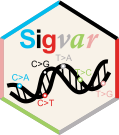

<!-- README.md is generated from README.Rmd. Please edit that file -->

# sigvar



<!-- badges: start -->

[](https://github.com/MaikeMorrison/sigvar/actions/workflows/R-CMD-check.yaml)
[](https://lifecycle.r-lib.org/articles/stages.html#stable)
[](https://opensource.org/licenses/MIT)
<!-- badges: end -->

The R package *sigvar* implements **sig**nature **var**iability
analysis, a framework for the analysis of mutational signature
activities within and across cancer samples. This R package accompanies
the paper [“Quantifying variability of cancer mutational signatures with
sigvar’’ by Morrison et
al.](https://doi.org/10.1101/2023.11.23.23298821); please refer to the
paper for more details on the methods presented in this package.

The *sigvar* package contains two core functions to perform signature
variability analysis:

- `sigvar`: Compute the within-sample diversity and across-sample
  heterogeneity of mutational signature activity in one or multiple
  populations of samples

- `sigboot`: Use bootstrapping to statistically compare the
  within-sample diversity and across-sample heterogeneity of the
  mutational signature activity between two or more groups of samples

*sigvar* also includes accessory functions for the visualization of
mutational signature data, such as:

- `plot_SBS_spectrum`: Plot the SBS mutational spectrum of one or more
  samples of mutational signatures

- `plot_signature_prop`: Plot the relative activities of mutational
  signatures in each sample as a stacked bar plot

- `plot_dots`: Plot the mean mutational signature contributions of one
  or more groups of samples

## Installation

Install *sigvar* from Bioconductor using the following code:

``` r
if (!require("BiocManager", quietly = TRUE)){
  install.packages("BiocManager")
}

BiocManager::install("sigvar")
```

You can also install the development version of *sigvar* from
[GitHub](https://github.com/MaikeMorrison/sigvar) with:

``` r
if (!require("devtools", quietly = TRUE)){
  install.packages("devtools")
}

devtools::install_github("MaikeMorrison/sigvar",
                         dependencies = TRUE, 
                         build_vignettes = TRUE)
```

Installation time ranges from 1 to 5 minutes depending on whether
dependencies also need to be installed. Run time is expected to be a few
minutes on a typical desktop computer.

The package has been tested on R version 4.1.2 on a Redhat Linux
platform and a Windows 10 Pro platform. The package is available under
the MIT license.

## Tutorial

A tutorial on the usage of *sigvar* is available in the `tutorial`
vignette, which is available via the following R code after package
installation:

``` r
vignette("sigvar_tutorial", package = "sigvar")
```

The run time of the tutorial is under 5 minutes.

## Vignettes

Vignettes reproducing figures and analyses from Morrison et al. are
available at
[github.com/IARCbioinfo/MS_sigvar](https://github.com/IARCbioinfo/MS_sigvar).

## Dependencies

dplyr, readr, ggplot2, rlang, tidyr, stringr, ggh4x, glue, ggtext,
ggforce, scales, GenomicFeatures, GenomeInfoDb,
BSgenome.Hsapiens.UCSC.hg38, BSgenome.Hsapiens.UCSC.hg19,
BSgenome.Mmusculus.UCSC.mm10, Biostrings, rtracklayer,
TxDb.Hsapiens.UCSC.hg38.knownGene, TxDb.Mmusculus.UCSC.mm10.knownGene,
lifecycle
