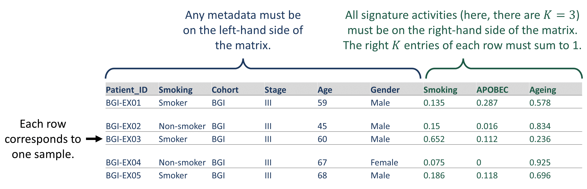

```{r load data, include = FALSE}
knitr::opts_chunk$set(
  collapse = TRUE,
  warning = FALSE,
  message = FALSE,
  comment = "#>",
  fig.width = 10
)
```

# Introduction

The R package *sigvar* implements **sig**nature **var**iability analysis, a framework for the analysis of mutational signature activities within and across cancer samples. This R package accompanies the paper ["Variability of mutational signatures is a footprint of carcinogens'' by Morrison et al.](https://doi.org/10.1101/2023.11.23.23298821); please refer to the paper for more details on the methods presented in this package.  

The *sigvar* package contains two core functions to perform signature variability analysis:

* `sigvar`: Compute the within-sample diversity and across-sample heterogeneity of mutational signature activity in one or multiple populations of samples

* `sigboot`: Use bootstrapping to statistically compare the within-sample diversity and across-sample heterogeneity of the mutational signature activity between two or more groups of samples

*sigvar* also includes accessory functions for the visualization of mutational signature data, such as:

* `plot_SBS_spectrum`: Plot the SBS mutational spectrum of one or more samples of mutational signatures

* `plot_signature_prop`: Plot the relative activities of mutational signatures in each sample as a stacked bar plot

* `plot_dots`: Plot the mean mutational signature contributions of one or more groups of samples

## Installation

Install sigvar from Bioconductor using the following code:

```{r install bioconductor, eval = FALSE}
if (!require("BiocManager", quietly = TRUE)){
  install.packages("BiocManager")
}

BiocManager::install("sigvar")
```

You can also install the development version of sigvar from [GitHub](https://github.com/MaikeMorrison/sigvar) with:

```{r install github, eval=FALSE}
if (!require("devtools", quietly = TRUE)){
  install.packages("devtools")
}

devtools::install_github("MaikeMorrison/sigvar",
                         dependencies = TRUE, 
                         build_vignettes = TRUE)
```

After installation, you can access this introductory vignette at an time by running:

```{r load vignette, eval = FALSE}
vignette("sigvar_tutorial", package = "sigvar")

# or

browseVignettes("sigvar")
```

## Connection to other Bioconductor R packages

There are several Bioconductor R packages available for the inference of mutational signatures, performing either de novo signature extraction (e.g., *RESOLVE*, *signeR*, *SomaticSignatures*) or fitting a mutational profile to a combination of known signatures (e.g., *YAPSA*). There are also broad packages that include these inference and fitting capabilities as well as downstream analyses and visualizations (e.g., *musicatk*, *MutationalPatterns*). 

The *sigvar* R package is downstream of all of these packages, computing the within-sample diversity and across-sample heterogeneity of mutational signature activities. Users of sigvar are welcome to use any of the above packages (or others) in order to generate mutational signature activities for analysis with *sigvar*. The present tutorial begins with such signature activities in hand and proceeds by explaining how to use *sigvar* to perform the statistical analyses introduced by [Morrison et al.](https://doi.org/10.1101/2023.11.23.23298821). While there is some overlap between the accessory functions of `sigvar` and existing packages (e.g., several other packages also include code to plot mutational signature profiles), the core capabilities of *sigvar* are entirely novel.  

## Overview

We begin the tutorial by explaining what types of data are required to use the *sigvar* R package ([Data specifications]). We then conduct an example of signature variability analysis ([Example analysis]), using  data from [Moody et al. (2021)](https://www.nature.com/articles/s41588-021-00928-6) to explore the within-sample diversity and across-sample heterogeneity of mutational signature activities for esophageal squamous cell carcinoma (ESCC) samples from eight countries which vary dramatically in their ESCC incidences. We begin our example analysis by introducing the data ([Example data]) and demonstrating the data visualization functions of *sigvar* ([Visualize mutational signature activities]). We then perform [Signature variability analysis], visualize the results, and use [Bootstrapping] to determine the statistical significance of differences in sigvar results between countries. Finally, in [Additional *sigvar* capabilities], we introduce some useful accessory functions.


# Data specifications

To use the *sigvar* package, your data must be in the form of a data frame, matrix, or tibble with rows corresponding to samples and columns corresponding to either metadata (on the left-hand side) or relative activities of mutational signatures (on the right hand side). You can read the data into R using functions such as `read.csv`, `data.table::fread`, or `readxl::read_xlsx`, depending on the file type.  

Each row of your matrix must correspond to one sample. If your matrix contains metadata, you must specify `K`, the number of signatures, and the signatures must all be on the right-hand side of the matrix. The relative activities of all `K` signatures must sum to 1 for each sample. 

```{r data schematic, out.width="500%", echo = FALSE}

```

Your matrix may contain samples from multiple groups you would like to analyze separately. In this case, you must provide the name of the column specifying the group each sample belongs to as the `group` parameter of the `sigvar` or `sigboot` functions. For example, to separately analyze the smokers and non-smokers in the matrix pictured above, we would specify `group = "Smoking"`.

## Optional: signature similarity matrix

If you would like to compute sigvar while accounting for the similarity among mutational signatures, you must provide the `sigvar` or `sigboot` functions with a similarity matrix, `S`, which must also be a  data frame, matrix, or tibble. Entry `S[i,j]` corresponds to the similarity of the mutational spectra of signatures `i` and `j`. All diagonal elements must equal 1 (i.e., `S[i,j]==1` when `i==j`), since each signature is identical to itself. All off-diagonal elements must be between 0 and 1, inclusive. In our analyses, we use cosine similarity matrices, where we define entry `S[i,j]` as the cosine similarity between the mutational spectra of signatures `i` and `j`. 

As an example, we present below the definitions of the 79 COSMIC (v3.1) SBS mutational signatures, which are included in the `sigvar` package under the file name `COSMIC3.3.1_SBS`. The first column of this data frame, `Type`, specifies the single-base substitution type defining each row, while the other columns (`SBS1`, `SBS2`, ..., `SBS95`) contain the relative abundance of each substitution type, which together determine the mutational spectrum of each SBS signature. 

```{r view cosmic SBS, echo = FALSE}
library(dplyr)
data(COSMIC3.3.1_SBS, package = "sigvar")

knitr::kable(COSMIC3.3.1_SBS %>% mutate(across(SBS1:SBS95, function(col) round(col, 3)))) %>%
  kableExtra::scroll_box(width = "600px", height = "300px")
```

In order to convert a matrix of signature definitions such as this matrix to a pairwise cosine similarity matrix, we recommend using the `cossim` function in the *sigvar* R package. Below we provide example code to both generate a similarity matrix from a matrix of mutational signature definitions and verify that its entries are between 0 and 1, and that its diagonal elements equal 1. 

```{r check cossim matrix}
# Exclude the first column, "Type", which defines each  mutational type
cosmic_sbs_sim <- sigvar::cossim(as.matrix(COSMIC3.3.1_SBS[, -1]))

# View the first 10 rows and 5 columns of the similarity matrix
cosmic_sbs_sim[1:10, 1:5]

# Confirm that the diagonal elements of the matrix are all equal to 1
all(diag(cosmic_sbs_sim) == 1)

# Confirm that all elements are non-negative
all(cosmic_sbs_sim >= 0)

# Confirm that no elements exceed 1
all(cosmic_sbs_sim <= 1)
```

When including a cosine similarity matrix in `sigvar` or `sigboot`, it is important that the ordering of signatures in the similarity matrix matches the ordering in your signature activity matrix. You should reorder the rows and columns of your similarity matrix to match your activity matrix:

```{r demonstrate reordering cossim matrix}
# Suppose this is the list of signatures included
# in your relative activity matrix:
sigs <- c("SBS95", "SBS10a", "SBS5", "SBS1", "SBS17b")

# Re-order the rows and columns of the similarity matrix
sim_reordered <- cosmic_sbs_sim[sigs, sigs]

sim_reordered
```


# Example analysis

```{r setup}
library(sigvar)
library(dplyr)
library(tidyr)
library(ggplot2)
library(patchwork)

# load data from the sigvar R package
data(ESCC_sig_activity, package = "sigvar")
data(ESCC_sig_similarity, package = "sigvar")
```

## Example data

In this example, we apply signature variability analysis (sigvar) to data from [Moody et al. (2021)](https://www.nature.com/articles/s41588-021-00928-6). This data set contains 552 esophageal squamous cell carcinoma (ESCC) samples collected across eight countries which vary dramatically in their incidence of ESCC. Moody et al. (2021) reported the activities of 43 SBS, DBS, and ID mutational signatures for each sample. 

The example data set, `ESCC_sig_activity`, has 552 rows, each corresponding to one sample, and 46 columns:

* `Country`: the country in which each sample was collected

* `Incidence_Level`: the ESCC incidence level of the country where the sample was collected 

* `Sample`: the identifier for each sample

* `SBS1`, `SBS2`, ..., `ID17`: the relative activities of the 43 mutational signatures reported by Moody et al. 

The rightmost 43 entries of each row sum to 1, since these entries correspond to the relative activities of all mutational signatures.

You can explore the structure of this data using the following functions:

```{r explore data, eval=FALSE}
# open the data set in a new window
View(ESCC_sig_activity)

# view the structure of the data set
str(ESCC_sig_activity)
```

Here are the first 40 rows and the first 20 columns of the relative abundance matrix, `ESCC_sig_activity`:

```{r show ESCC_sig_activity, echo=FALSE}
knitr::kable(ESCC_sig_activity[1:40, 1:20]) %>%
  kableExtra::scroll_box(width = "600px", height = "300px")
```


We also provide in the *sigvar* R package a pairwise similarity matrix, `ESCC_sig_similarity`, which contains the cosine similarity of every pair of mutational signatures in `ESCC_sig_activity`. Here are the first 20 rows and the first 20 columns of our example pairwise similarity matrix, `ESCC_sig_similarity`:

```{r show sim matrix for ESCC, echo = FALSE}
knitr::kable(ESCC_sig_similarity[1:20, 1:20]) %>%
  kableExtra::scroll_box(width = "600px", height = "300px")
```

Here is a heat map plot of the similarity matrix:

```{r cossim heat map, fig.height = 7, echo = FALSE}
ggplot(ESCC_sig_similarity %>%
  data.frame() %>%
  mutate(name2 = rownames(ESCC_sig_similarity)) %>%
  pivot_longer(
    cols = 1:43,
    values_to = "Similarity"
  ) %>%
  mutate(across(
    c(name, name2),
    function(col) {
      factor(col,
        ordered = TRUE,
        levels = colnames(ESCC_sig_similarity)
      )
    }
  ))) +
  geom_raster(aes(
    x = name,
    y = name2,
    fill = Similarity
  )) +
  theme_minimal() +
  scale_fill_viridis_c() +
  theme(
    axis.text.y = element_text(size = 6),
    axis.text.x = element_text(
      size = 6,
      angle = -90,
      hjust = 0
    ),
    axis.title = element_blank()
  )
```

Note that:

* The diagonal elements of this matrix are all 1, since each signature is identical to itself

* The columns and rows are in the same order (i.e., column 1 corresponds to the same signature as row 1, etc.)

* The ordering of the signatures in the similarity matrix, `ESCC_sig_similarity`, matches the ordering in the relative abundance matrix, `ESCC_sig_activity`.


## Visualize mutational signature activities

We can visualize these signature activities using the function `plot_signature_prop`, which generates a series of stacked bar plots. Each vertical bar corresponds to one sample (i.e., one row of `ESCC_sig_activity`). 

Because `ESCC_sig_activity` contains metadata, we specify `K=43` so that only the rightmost 43 columns are treated as signature abundances. Specifying `group = "Country"` creates one panel for each country, while specifying `arrange = TRUE` reorders signatures vertically from most to least abundant and reorders samples horizontally by the abundances of their most abundant signatures. 

Because `plot_signature_prop` returns a ggplot2 object, it can be modified with ggplot2 functions, such as `scale_color_manual` and `scale_fill_manual`.

```{r plot sig activity}
data(all_sig_pal, package = "sigvar")

plot_signature_prop(
  relab_matrix = ESCC_sig_activity,
  K = 43,
  group = "Country",
  arrange = TRUE
) +
  scale_color_manual(values = all_sig_pal) +
  scale_fill_manual(values = all_sig_pal)

# all_sig_pal is a vector of hex color codes, each corresponding to
# one signature used in our paper.
# Below we show the first 6 entries as an example.
all_sig_pal[1:6]
```


We can also visualize the country-level mean signature activities with the function `plot_dots` in the *sigvar* R package. 

```{r dot plots, fig.width=8}
plot_dots(
  sig_activity = ESCC_sig_activity,
  K = 43, group = "Country",
  facet = "Incidence_Level",
  pivot = TRUE
)
```


## Signature variability analysis

Signature variability analysis can be conducted in a single line of code:

```{r compute sigvar}
sigvar <- sigvar(
  sig_activity = ESCC_sig_activity,
  K = 43,
  S = ESCC_sig_similarity,
  group = "Country"
)

knitr::kable(sigvar)
```

Signature variability analysis quantifies both the mean signature diversity within each sample, as well as the heterogeneity in signature activities across samples. Both variability statistics range between 0 and 1. 

If we add to our sigvar results a column corresponding to the incidence of each country, we are able to determine if signature heterogeneity or diversity are associated with ESCC incidence. 

```{r sigvar by country}
sigvar_incidence <- ESCC_sig_activity %>%
  transmute(
    Country = as.character(Country),
    Incidence_Level
  ) %>%
  distinct() %>%
  right_join(sigvar)

knitr::kable(sigvar_incidence)

ggplot(
  sigvar_incidence,
  aes(
    x = mean_within_sample_diversity,
    y = across_sample_heterogeneity,
    color = Incidence_Level
  )
) +
  geom_point(size = 4) +
  ggrepel::geom_text_repel(aes(label = Country)) +
  theme_bw()

ggplot(
  sigvar_incidence %>%
    pivot_longer(
      cols = c(
        "across_sample_heterogeneity",
        "mean_within_sample_diversity"
      ),
      names_to = "Statistic",
      values_to = "sigvar"
    ),
  aes(x = Incidence_Level, y = sigvar)
) +
  geom_boxplot(aes(color = Incidence_Level)) +
  geom_point(aes(color = Incidence_Level), size = 4, alpha = 0.6) +
  facet_wrap(~Statistic, scales = "free_y") +
  ggpubr::stat_compare_means(method = "t.test") +
  theme_bw()
```

We see that high-ESCC-incidence countries have more within-sample signature diversity and less across-sample heterogeneity than low-incidence countries.


## Bootstrapping

When comparing one group of populations to another group of populations, like when comparing high- and low-incidence countries, we can use conventional statistical tests for comparing two distributions, such as Wilcoxon rank-sum tests and T-tests. However, when comparing the sigvar results of just one population to another population (say we wanted to compare the sigvar results of just Japan to those of just Kenya), we rely on a statistical method known as bootstrapping (implemented as `sigboot` in the *sigvar* R package). 

We will demonstrate sigboot with an example comparing Japan ($n=37$ samples) to Kenya ($m=68$ samples). Bootstrapping proceeds in the following steps:

1. Merge the two relative abundance matrices to generate a single matrix with $n+m$ samples.

2. Draw $n$ samples with replacement from this merged matrix. This generates a bootstrap replicate of Japan. Compute sigvar with this replicate matrix.

3. Draw $m$ samples with replacement from the merged matrix to generate a bootstrap replicate of Kenya. Compute sigvar with this replicate matrix.

4. Compute the difference between the values of each sigvar statistic from steps 3 and 4.

5. Repeat steps 2-4 many times to generate many bootstrapped differences in sigvar values between Japan and Kenya under the null hypothesis that there is no true difference in the distribution generating their samples.

6. Compare the true difference in sigvar values between Japan and Kenya to the distribution of bootstrapped differences. The fraction of bootstrap replicate differences whose absolute values are greater than the absolute value of the true value is the two-sided P-value for our statistical test. One-sided tests could be performed by computing the fraction of differences greater or less than the true value.

This procedure is implemented in the function `sigboot`, which can conduct many pairwise comparisons. In the below example, we generate 500 bootstrap replicates  (`n_replicates = 500`) of the difference in sigvar values between each country (`group = "Country"`) in our signature activity matrix (`relab_matrix = ESCC_sig_activity`). We account for the cosine similarity between signatures in each computation (`S = ESCC_sig_similarity`). Because bootstrapping is a random process, running the code multiple times would give slightly different results. Setting a random seed (`seed = 1`) makes this result repeatable. If you wish to perform a one-sided statistical test, you can specify `alternative = "lesser"` or `alternative = "greater"`; the default value is `alternative = "two.sided"`.

```{r bootstrapping}
comparison_boot <- sigboot(
  sig_activity = ESCC_sig_activity %>%
    filter(Country %in% c("Japan", "Kenya")),
  K = 43,
  group = "Country",
  S = ESCC_sig_similarity,
  n_replicates = 500,
  seed = 1
)

comparison_boot$bootstrap_distribution_plot
```

We see that, for the sigvar statistics `across_sample_heterogeneity` and `mean_within_sample_diversity`, the red dots fall far outside of the range of most of the black dots, suggesting that there is a significant difference in sigvar results between Kenya and Japan. This difference is reflected by low two-sided P-values:

```{r view p values}
comparison_boot$P_values
```

# Additional *sigvar* capabilities

`get_SBS96_spectrum` is a function to obtain the SBS96 spectrum of a transcript based on its ensembl ID. For example, to get the SBS96 spectrum of the gene TP53, we would run the following code: 

```{r load TP53 spectrum}
TP53_spectrum <- get_SBS96_spectrum(transcript = "ENST00000269305.9")

# look at first 10 entries
TP53_spectrum[1:10]
```

`get_SBS96_driver_spectrum` is a function to obtain the SBS spectrum of a table of driver alterations. Here, we load the table of TP53 driver mutations from the LUAD database. 

```{r TP53 drivers}
data(TP53_drivers_intogen_LUAD, package = "sigvar")
TP53_driver_spectrum <- get_SBS96_driver_spectrum(TP53_drivers_intogen_LUAD)

# look at first 10 entries
TP53_driver_spectrum[1:10]
```

`plot_SBS96_spectrum` is a function to plot such a spectrum, such as the one below for TP53 driver mutations. 

```{r plot TP53 SBS spectrum}
plot_SBS_spectrum(data.frame(TP53_driver_spectrum) %>% 
                    `colnames<-`(c("ref", "TP53")) %>% 
                    select(TP53))
```

We can compute the ratio of these two spectra in order to compute the proportion of mutations that are drivers in each of the 96 SBS contexts:

```{r}
TP53_driver_prop <- TP53_driver_spectrum / TP53_spectrum

TP53_driver_prop[1:10]
```


# Conclusion

This concludes the tutorial on the *sigvar* R package for signature variability analysis. We hope you found it helpful! For guidance on specific functions, access the documentation by typing `?` into the R console (e.g., `?sigboot`). To see all available functions, type `?sigvar::`. For more details on signature variability analysis, see the paper ["Variability of mutational signatures is a footprint of carcinogens'' by Morrison et al](https://doi.org/10.1101/2023.11.23.23298821).   If you find a problem with the R package, please [open an issue on Github using this link](https://github.com/MaikeMorrison/sigvar/issues). 


# Session information

```{r session info}
sessionInfo()
```
