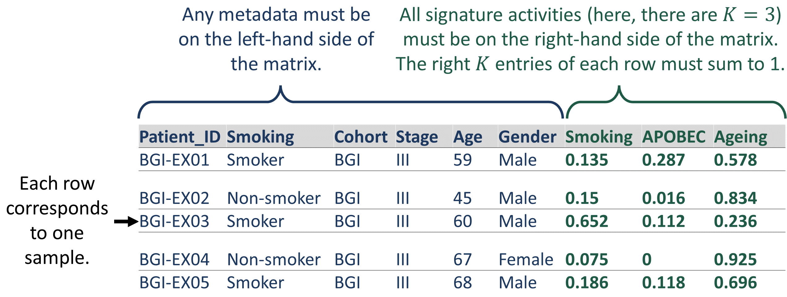

```{r, include = FALSE}
knitr::opts_chunk$set(
  collapse = TRUE,
  warning = FALSE,
  message = FALSE,
  comment = "#>",
  fig.width = 8
)
```


# Introduction

The R package *sigvar* implements **sig**nature **var**iability analysis, a framework for the analysis of mutational signature activities within and across cancer samples. The *sigvar* package contains two core functions to perform signature variability analysis:

* `sigvar`: Compute the within-sample diversity and across-sample heterogeneity of mutational signature activity in one or multiple populations of samples

* `sigboot`: Use bootstrapping to statistically compare the within-sample diversity and across-sample heterogeneity of the mutational signature activity between two or more groups of tumor samples

*sigvar* also includes accessory functions for the visualization of mutational signature data, such as:

* `plot_SBS_spectrum`: Plot the SBS mutational spectrum of one or more samples of mutational signatures

* `plot_signature_prop`: Plot the relative activities of mutational signatures in each sample as a stacked bar plot

* `plot_dots`: Plot the mean mutational signature contributions of one or more groups of samples

## Installation

You can install the development version of sigvar from [GitHub](https://github.com/MaikeMorrison/sigvar) with:

```{r, eval=FALSE}
install.packages("devtools") # run only if devtools not already installed
devtools::install_github("MaikeMorrison/sigvar", dependencies = TRUE)
```

The package requires packages `dplyr`, `ggplot2`, `rlang`, `tidyr`, and `readr`. They will all be installed automatically by the command above. Installation time ranges from 1 to 5 minutes depending on whether dependencies also need to be installed.


## Overview

In this tutorial, we will explain the data required to use the *sigvar* R package ([Data specifications]). We will then analyze example data from [Moody et al. (2021)](https://www.nature.com/articles/s41588-021-00928-6) ([Example analysis]). With this data set and the *sigvar* R package, we conduct signature variability analysis, exploring the within-tumor diversity and across-tumor heterogeneity of mutational signature activities for esophageal squamous cell carcinoma (ESCC) samples from eight countries which vary dramatically in their ESCC incidences. 

<!-- microbiome composition of three subjects over time, use FAVA to quantify the temporal variability across these microbiome samples, and explore these dynamics at a finer resolution using sliding windows over time. -->


# Data specifications

To use the *sigvar* package, your data must be in the form of a data frame, matrix, or tibble with rows corresponding to samples and columns corresponding to either metadata (on the left-hand side) or relative activities of mutational signatures (on the right hand side). The relative activities of all signatures must sum to 1 for each sample. If your matrix contains metadata, you must specify `K`, the number of signatures. 

```{r, out.width="500%", echo = FALSE}

```

Your matrix may contain samples from multiple groups you would like to analyze separately. In this case, you must provide the name of the column specifying the group each sample belongs to as the `group` parameter of the `sigvar` or `sigboot` functions. For example, to separately analyze the smokers and non-smokers in the matrix pictured above, we would specify `group = "Smoking"`.

## Optional: cosine similarity matrix

If you would like to perform SVA while accounting for the similarity among mutational signatures, provide a similarity matrix, `S`. Entry `S[i,j]` corresponds to the similarity of the mutational spectra of signatures `i` and `j`. `S[i,j]=1` when `i==j`. In general `S[i,j]` takes values between 0 and 1, inclusive. In our analyses, we use cosine similarity matrices, where we define each entry as the cosine similarity between the mutational spectra of two signatures.


# Example analysis

```{r setup}
library(sigvar)
library(dplyr)
library(tidyr)
library(ggplot2)
library(patchwork)
```

## Example data

In this example, we apply signature variability analysis (SVA) to data from [Moody et al. (2021)](https://www.nature.com/articles/s41588-021-00928-6). This data set contains 552 esophageal squamous cell carcinoma (ESCC) samples collected across eight countries which vary dramatically in their incidence of ESCC. Moody et al. (2021) reported the activities of 43 SBS, DBS, and ID mutational signatures for each sample. 

The example data set, `ESCC_sig_activity`, has 552 rows, each corresponding to one tumor sample, and 46 columns:

* `Country`: the country in which each sample was collected

* `Incidence_Level`: the ESCC incidence level of the country where the sample was collected 

* `Sample`: the identifier for each sample

* `SBS1`, `SBS2`, ..., `ID17`: the relative activities of the 43 mutational signatures reported by Moody et al. 

The rightmost 43 entries of each row sum to 1, since these entries correspond to the relative activities of all mutational signatures.

You can explore the structure of this data using the following functions:
```{r, eval=FALSE}
# open the data set in a new window
View(ESCC_sig_activity)

# view the structure of the data set
str(ESCC_sig_activity)
```

Here are the first 40 rows and the first 20 columns of the relative abundance matrix, `ESCC_sig_activity`:
```{r echo=FALSE}
knitr::kable(ESCC_sig_activity[1:40,1:20]) %>%
    kableExtra::scroll_box(width = "600px", height = "300px")
```


We also provide in the *sigvar* R package a pairwise similarity matrix, `ESCC_sig_similarity`, which contains the cosine similarity of every pair of mutational signatures in `ESCC_sig_activity`. Here are the first 20 rows and the first 20 columns of our example pairwise similarity matrix, `ESCC_sig_similarity`:
```{r, echo = FALSE}
knitr::kable(ESCC_sig_similarity[1:20, 1:20])  %>%
    kableExtra::scroll_box(width = "600px", height = "300px")
```

Here is a heat map plot of the similarity matrix:
```{r, fig.height = 7, echo = FALSE}
ggplot(ESCC_sig_similarity %>%
         data.frame() %>%
         mutate(name2 = rownames(ESCC_sig_similarity)) %>%
         pivot_longer(cols = 1:43,
                      values_to = "Similarity") %>% 
         mutate(across(c(name, name2), function(col) factor(col, ordered = TRUE, levels = colnames(ESCC_sig_similarity))))) +
  geom_raster(aes(x = name,
                  y = name2,
                  fill = Similarity)) +
  theme_minimal() + scale_fill_viridis_c() +
  theme(axis.text.y = element_text(size = 6),
        axis.text.x = element_text(size = 6,
                                   angle = -90,
                                   hjust = 0),
        axis.title = element_blank())
```

Note that:

* The diagonal elements of this matrix are all 1, since each signature is identical to itself

* The columns and rows are in the same order (i.e., column 1 corresponds to the same signature as row 1, etc.)

* The ordering of the signatures in the similarity matrix, `ESCC_sig_similarity`, matches the ordering in the relative abundance matrix, `ESCC_sig_activity`.


## Visualize mutational signature activities

We can visualize these signature activities using the function `plot_signature_prop`, which generates a series of stacked bar plots. Each vertical bar corresponds to one sample (i.e., one row of `ESCC_sig_activity`). 

Because `ESCC_sig_activity` contains metadata, we specify `K=43` so that only the rightmost 43 columns are treated as signature abundances. Specifying `group = "Country"` creates one panel for each country, while specifying `arrange = TRUE` reorders signatures vertically from most to least abundant and reorders samples horizontally by the abundances of their most abundant signatures. 

Because `plot_signature_prop` returns a ggplot2 object, it can be modified with ggplot2 functions, such as `scale_color_manual` and `scale_fill_manual`.

```{r}
plot_signature_prop(relab_matrix = ESCC_sig_activity, 
              K = 43, 
              group = "Country",
              arrange = TRUE) + 
  scale_color_manual(values = all_sig_pal)  + 
  scale_fill_manual(values = all_sig_pal)

# all_sig_pal is a vector of hex color codes, each corresponding to 
# one signature used in our paper. 
# Below we show the first 20 entries as an example.
all_sig_pal[1:20]
```


We can also visualize the country-level mean signature activities with the function `plot_dots` in the *sigvar* R package. 

```{r, fig.width=8}
plot_dots(sig_activity = ESCC_sig_activity, 
          K = 43, group = "Country", 
          facet = "Incidence_Level", 
          pivot = TRUE)
```


### Signature variability analysis

Signature variability analysis can be conducted in a single line of code:

```{r}
sva = sigvar(sig_activity = ESCC_sig_activity, K = 43, S = ESCC_sig_similarity, group = "Country")

knitr::kable(sva)
```

Signature variability analysis quantifies both the mean signature diversity within each sample, as well as the heterogeneity in signature activities across samples. Both variability statistics range between 0 and 1. 

If we add to our SVA results a column corresponding to the incidence of each country, we are able to determine if signature heterogeneity or diversity are associated with ESCC incidence. 

```{r}
sva_incidence = ESCC_sig_activity %>% 
  transmute(Country = as.character(Country), 
            Incidence_Level) %>%
  distinct %>%
  right_join(sva)
  
knitr::kable(sva_incidence)

ggplot(sva_incidence,
       aes(x = mean_within_sample_diversity, 
           y = across_sample_heterogeneity, 
           color = Incidence_Level)) + 
  geom_point(size = 4) +
  ggrepel::geom_text_repel(aes(label = Country)) +
  theme_bw()
```

We see that high-ESCC-incidence countries have more within-sample signature diversity and less across-sample heterogeneity than low-incidence countries.

<!-- ```{r} -->
<!-- sva_incidence %>%  -->
<!--   tidyr::pivot_longer(cols = c(across_sample_heterogeneity, mean_within_sample_diversity), -->
<!--                       names_to = "Variability_statistic") %>% -->
<!-- ggplot(aes(x = Incidence_Level, y = value, fill = Incidence_Level)) +  -->
<!--   geom_violin(color = NA, alpha = 0.75) + -->
<!--   ggbeeswarm::geom_beeswarm() + -->
<!--   ggpubr::stat_compare_means(method = "t.test") +  -->
<!--   facet_wrap(~ Variability_statistic, scales = "free") + -->
<!--   theme_bw() -->
<!-- ``` -->


## Bootstrapping

We use bootstrapping (`sigboot`) to statistically compare the signature diversity or heterogeneity of cancer samples. For example, the below code compares SVA results among the low-incidence countries.

```{r}
low_inc_boot = sigboot(sig_activity = ESCC_sig_activity %>% 
                         filter(Incidence_Level == "Low"),
                       K = 43, 
                       group = "Country",
                       n_replicates = 100, 
                       seed = 1)
```

In short, the bootstrapping algorithm involves taking a pair of populations (for example, Japan and Brazil), scrambling their samples up many times (with some samples randomly duplicated and others omitted), conducting SVA on the scrambled populations, and then comparing the difference between SVA results for each scrambled population (black dots) to the true difference (red dots). We can see in the below plot that the red dots fall in the middle of the black dots, suggesting that there is not a significant difference in SVA results between Japan and Brazil. 

```{r}
low_inc_boot$bootstrap_distribution_plot$`Japan--Brazil`
```

This lack of significance is quantified by the two-sided P-value comparing each pair of countries: 

```{r}
low_inc_boot$P_values %>%  data.frame() %>% select(-pooled_diversity)
```

However, suppose we compare a high-incidence country like Kenya to a low-incidence country like Japan:

```{r}
comparison_boot = sigboot(sig_activity = ESCC_sig_activity %>% 
                         filter(Country %in% c("Japan", "Kenya")),
                       K = 43, 
                       group = "Country",
                       n_replicates = 100, 
                       seed = 1)

comparison_boot$bootstrap_distribution_plot
```

We see that, for the SVA statistics `across_sample_heterogeneity` and `mean_within_sample_diversity`, the red dots fall far outside of the range of most of the black dots, suggesting that there is a significant difference in SVA results between Kenya and Japan. This difference is reflected by low two-sided P-values:

```{r}
comparison_boot$P_values %>%  data.frame() %>% select(-pooled_diversity)
```
